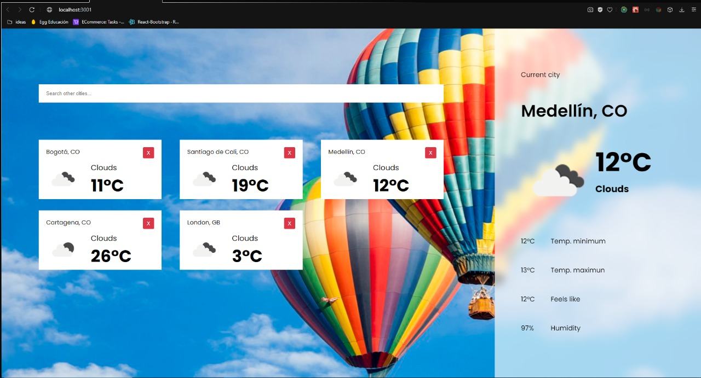
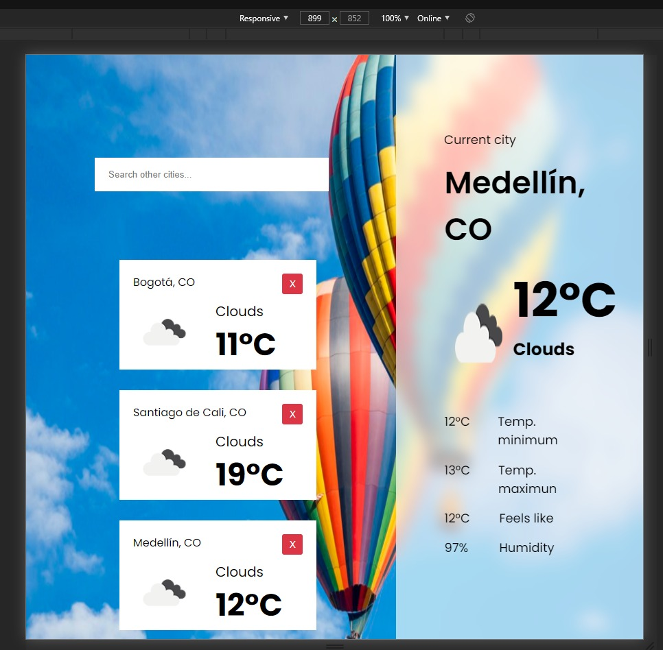
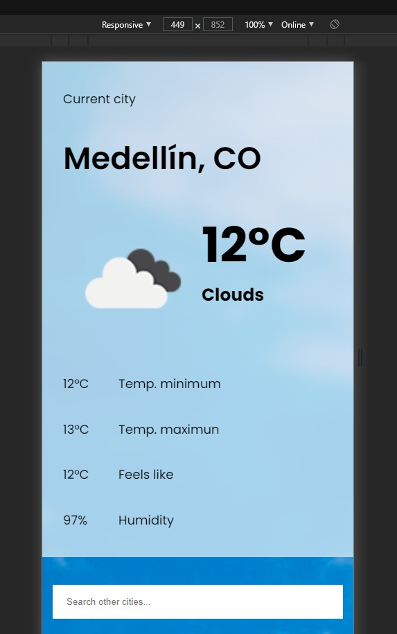
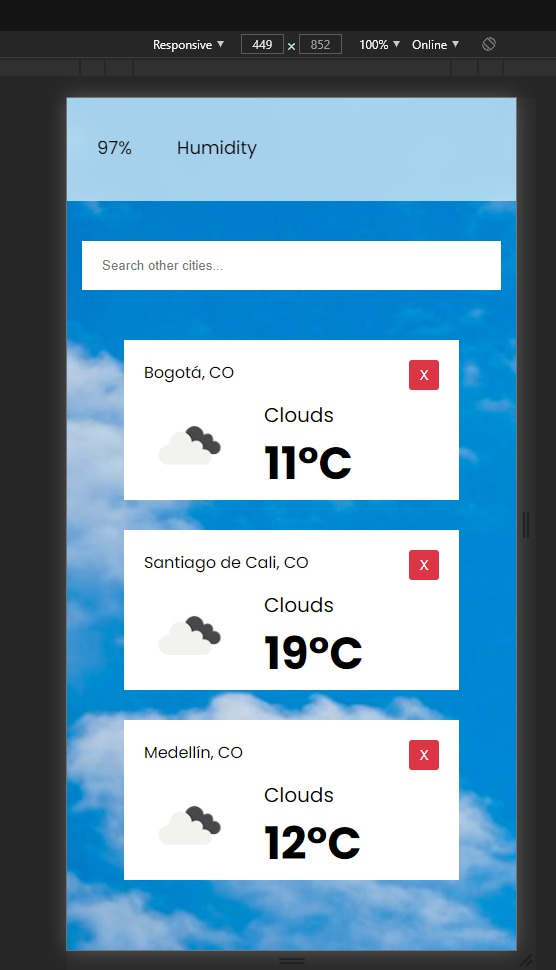

<h1>WEATHER APP EVOION</h1>

    </img>

<h1>Como Correr el proyecto</h1>
<ul>
<li>Crea un archivo dentro de la carpeta "api" llamado env.js con el siguiente contenido:
<pre>
<code>
REACT_APP_API_KEY=aquivatuAPIKEY
</code>
</pre>
<li>En caso de no tener unaa APIKEY se puede utilizar la siguiente: 018518d74545467f9c5eed9e1e8836a3</li>
<li>Posicionate en la carpeta donde clonaste el repositorio y ejecuta npm install</li>
<li>En una terminal  Posicionate en la carpeta que clonaste y ejecuta npm start</li>
</ul>

<h1>RESUMEN</h1>

    Estas fueron todas las configuraciones que debes hacer para correr el proyecto. Ahora vas a poder buscar el clima de las ciudades deseadas.

    Puedes consular las ciudades que mas gustes y en caso de eliminar una tarjeta lo puedes hacer pulsando el boton de cerrar 

<h1>RESPONSIVE</h1>

    La aplicacion cuenta con responsive web la cual parte de los 900px y 600px para una mejor experiencia de usuario 

<h2>
    Responsive 900px
</h2>

    </img>

<h2>
    Responsive 600px
</h2>

    </img>

    </img>

    <h1> TECNOLOGIAS USADAS </h1>
        <h2>FRONTEND</h2>
        <ul>
            <li>React </li>
            <li>React hooks</li>
            <li>Redux</li>
            <li>Redux hooks</li>
            <li>styled components</li>
        </ul>

